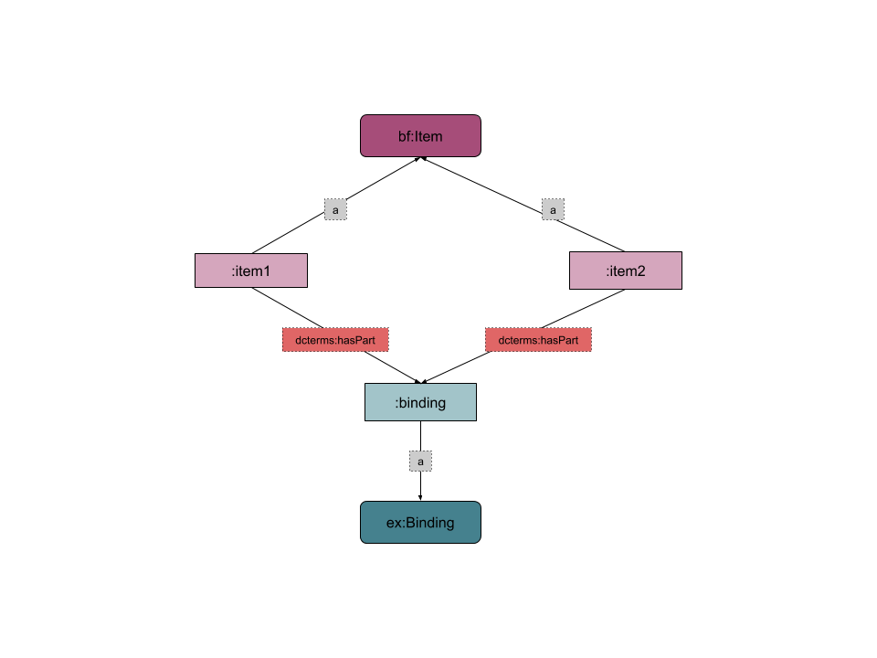
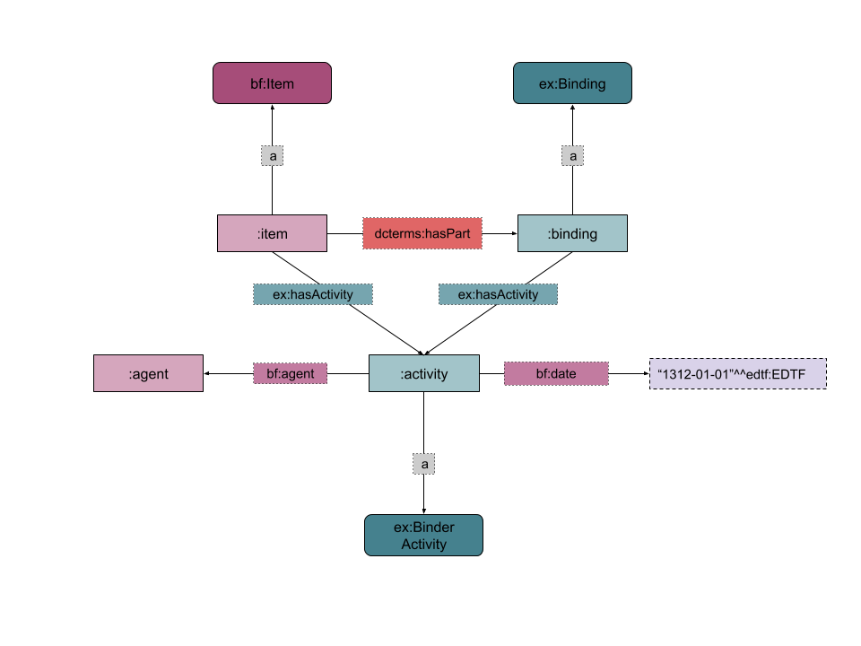

Bindings
==============
RareMat, 2018.03.16

Table of Contents
> - [Introduction](#introduction)
> - [Sample Data](#sampledata)
> - [Bindings in BIBFRAME](#bfbindings)
> - [Overview of the RareMat Binding Model](#rarematbindings)
> - [Activities in the Binding Model](#activities)
> - [Diagram: Basic Binding Model](#diagramBasic)
> - [Many-to-Many Item-to-Binding Relationships (including diagrams)](#many)
> - [Term Specifications](#terms)
> - [Vocabularies and Taxonomies](#vocabs)
> - [Sample RDF](#rdf)
> - [Areas for Future Research](#futureresearch)


<a name="introduction">Introduction</a>
-------------
“Coverings of a book which hold the sheets together to provide protection, and collectively all the parts of books applied in the process of attaching the leaves and covering them.” --AAT

Prior to the machine-press era (mid-1800s), the majority of bindings were bespoke, often commissioned by the owner of a book and executed by a binder. As book production was modernized, publishers began to produce bindings to be sold with their books. In this case, binding can be an instance-level attribute. 

An item can have its original binding replaced over time by an owner or for preservation/conservation purposes. It is also not uncommon for a library to discard an original binding and rebind in a standard library binding. Conversely, though less well known, a single binding may be attached to different items over time, for a variety of reasons; see > - [Many-to-Many Item-to-Binding Relationships](#many-to-many).

Bindings are of interest to researchers for many reasons. Bindings can help date a book based on styles and materials used, as well as information printed on bindings that is not included in the text block, such as a later imprint date on a binding than on a title page. Bindings are of aesthetic interest, and can be designed by artists and notable binders. Bindings can also carry important provenance information, such as a coat of arms of the owner.

Note that the English word “binding” is ambiguous between binding as a process or activity and binding as a thing; here we use the term in the latter sense, while the class [BinderActivity](#BinderActivity) defined below refers to the former. 


<a name="sampledata">Sample Data</a>
-------------
“Pictorial cloth binding with gold, brown, and green stamping on brown calico-textured cloth, designed by Margaret Armstrong; signed: M.A.”

“British Library copy: late 17th-century English binding; red goatskin, gold-tooled, over paper boards; gold-tooled spine with five raised bands; gilt edges; gold roll on edges of boards; marbled endpapers”

<a name="bfbindings">Bindings in BIBFRAME</a>
-------------
By intent, BIBFRAME does not provide deep modeling of resource components or physical description; these areas are left to domain extensions.  There is consequently no modeling of bindings in BIBFRAME.

<a name="rarematbindings">Overview of the RareMat Binding Model</a>
-------------
Most of the proposed Binding model relies on terms from other ontologies: BIBFRAME, DCMI Terms, other Raremat/ArtFrame models, and controlled vocabularies for types and parts of bindings. The terms specific to this model are the Binding class itself and the class hierarchy in which it is positioned, and Binding-related Activity classes.

Bindings can be attached to both Instances (as issued) and Items. Bindings can also be Works 
in their own right. Bindings that are also Works do not need any specific modeling other than that provided by general Work models.

The Binding class is defined within a class hierarchy of enclosures. The superclass, Enclosure, has subclasses Binding, DustJacket, SlipCase, WrapAroundBand, and Wrapper; others could be defined later as the need arises. It has been noted that Bindings, unlike the other subtypes, are not ordinarily removable (that is, only in the process of conservation or other institutional activity, rather than by ordinary users), but, though we do allow for removal of a binding from one item and subsequent attachment to another (see  Many-to-Many Item-to-Binding relationships),  we have as yet seen no need to make a formal distinction between removable and non-removable enclosures within the ontology (see Areas for Future Research).  

We also define here three additional classes representing parts of bibliographic resources, Mount and two subclasses, Frame and Pedestal. No specific modeling is provided for these types at this time, and we expect them to generally profile with bindings.
Related Raremat/ArtFrame Models

The Binding model connects to other Raremat/ArtFrame models, as shown by the diagram below:
> - <a href="https://github.com/LD4P/ArtFrame-RareMat/blob/master/modeling_recommendations/Markings.md">Markings (including Autographs)</a>
> - <a href="https://github.com/LD4P/ArtFrame-RareMat/blob/master/modeling_recommendations/materials.md">Materials </a>
> - <a href="https://github.com/LD4P/ArtFrame-RareMat/blob/master/modeling_recommendations/physical_condition.md">Physical condition and conservation</a>

<a name="activities">Activities in the Binding Model</a>
---------------------------

The <a href="https://wiki.duraspace.org/download/attachments/79795231/bibliotek-o_pattern_activities_201612.pdf?version=1&modificationDate=1492564529518&api=v2">bibliotek-o Activity model</a> is now incorporated directly into Raremat/ArtFrame. Raremat/ArtFrame defines the Activity superclass and related predicates hasActivity and isActivityOf. Each specific Raremat/ArtFrame model will define required Activity subclasses. 

Original bibliotek-o Activity subclasses involved in the Binding model are at minimum:
> - DesignerActivity
> - CreatorActivity
> - BinderActivity

bibliotek-o Activity types that also may be of use in the Binding model are:
> - EngraverActivity
> - MarblerActivity

New Activity types not included in bibliotek-o could also be defined, such as GilderActivity.

bibliotek-o defined a BindingDesignerActivity, which will not be carried forward into the Binding model. It is replaced by DesignerActivity linked directly to a Binding resource, rather than to an Item or Instance, and thus an activity explicitly referencing a binding is no longer needed. 

Style/Period/Technique/Instrument
--------------------

Style/period/technique/instrument are areas that relate to bindings but are not binding-specific. See the Style and Period recommendation. 

<a name="diagramBasic">Diagram: Basic Binding Model</a>
---------------------------


<a name="many">Many-to-Many Item-to-Binding Relationships</a>
-----------------------
An item can have its original binding replaced over time by an owner or for preservation/conservation purposes.


The converse is also true, under a variety of circumstances. Treasure bindings, made from jewels and precious metals, such as the binding of the <a href="http://www.themorgan.org/collection/lindau-gospels">Lindau Gospels</a>, could be removed from the original item, sold, and transferred to another book. This may occur with less valuable bindings as well, such as <a href="https://clio.columbia.edu/catalog/6167779">a copy of Reineke Fuchs rebound in a publisher's binding from The Works of Daniel Webster</a>. There are also instances of a binding being reapplied to a contraband or censored text in order to conceal the contents. The term <a href="http://www.ligatus.org.uk/lob/concept/4244">remboîtage</a> has been established for the practice of transferring into a superior binding a text more interesting or valuable than the one for which it was made. 



The relationship between an item and a binding is therefore potentially time-delimited, but our current models do not provide a way to attach dates to the relationship. A context node would be required to represent the relationship with dates and other information attached; this is a significant complication of the model and we leave it for future research to determine whether there are valid use cases for this level of complexity. 

The BinderActivity resource, representing the act of attaching a binding to an item, can be dated, since it constitutes an Activity node to which a date (and other information) can be attached.

<a name="BinderActivity">BinderActivity</a>
The BinderActivity, defined as “The activity of attaching a Binding a resource,” is an interesting case because it relates to both a Binding and an Instance/Item. Since a Binding can attach to more than one Item during its lifespan, and an Item can have multiple Bindings during its lifespan (see Many-to-Many Item-to-Binding Relationships), the activity must connect to both in order to accurately represent the relationships. 



<a name="terms">Term Specifications</a>
-----------------

Classes
-----
**ex:Enclosure**
> - **URI:** TBD
> - **Label:** Enclosure
> - **Definition:** Any type of box, holder, or container designed for storing an item, part of an item, or a group of items, physically separable from its contents.
> - **Scope note:** This class includes containers, such as a box containing a paper doll set.

**ex:Binding**
> - **URI:** TBD
> - **Label:** Binding
> - **Definition:** Covering of a book which holds the sheets together to provide protection, and collectively all the parts of a book applied in the process of attaching the leaves and covering them.
> - **Subclass of:** Enclosure

**ex:DustJacket**
> - **URI:** TBD
> - **Label:** Dust jacket
> - **Definition:** A detachable, flexible covering for a book, usually of paper cut flush with the covers, folding around the binding with the ends tucked in between the cover boards and the free end paper. 
> - **Subclass of:** Enclosure

**ex:Frame**
> - **URI:** TBD
> - **Label:** Frame
> - **Definition:** A supportive structure that surrounds or encloses an item. 
> - **Subclass of:** Mount

**ex:Mount**
> - **URI:** TBD
> - **Label:** Mount
> - **Definition:** An item placed on a pedestal or a case, or otherwise attached to a print, photographic image, or document protected by framing, usually against a backing material.

**ex:Pedestal**
> - **URI:** TBD
> - **Label:** Pedestal
> - **Definition:** A solid, fixed base or support on which an item or part of an item is mounted.
> - **Subclass of:** Mount

**ex:SlipCase**
> - **URI:** TBD
> - **Label:** Slip case
> - **Definition:** Protective container designed to protect a book or item with open end along one edge. 
> - **Subclass of:** Enclosure

**ex:WrapAroundBand**
> - **URI:** TBD
> - **Label:** Wrap around band
> - **Definition:** A printed paper the length of the dust jacket but smaller in height and wrapped around the book. It typically has reviews and is used for promotional purposes; may be added post-publication.
> - **Subclass of:** Enclosure

**ex:Wrapper**
> - **URI:** TBD
> - **Label:** Wrapper
> - **Definition:** A flexible printed or unprinted cover, usually made of paper, attached to a book or pamphlet; commonly used as an inexpensive temporary binding in the late 18th and early 19th century.
> - **Subclass of:** Enclosure

**ex:TextBlock**
> - **URI:** TBD
> - **Label:** Text block
> - **Definition:** Those parts of a book consisting of the stack of leaves or gatherings to be bound, exclusive of the materials, such as endpapers or boards, that are added in binding.
> - **Disjoint with:** ex:Enclosure
> - **Scope note:**  The measurements of a book may include the binding or not. A text block resource can be used in the specification of measurements exclusive of the binding.

**ex:BinderActivity**
> - **URI:** TBD
> - **Label:** Binder 
> - **Definition:** The activity of attaching a Binding to a resource.
> - **Scope note:** Both Instance and Items can have Bindings, but generally the binder is only identified in the case of an Item.
> - **Scope note:** This class is derived from the MARC relator: http://id.loc.gov/vocabulary/relators/bnd.
> - **Editorial note:** Future work: consider more formal alignment between the class and corresponding MARC relator.
> - **Subclass of:** ex:Activity

**ex:CreatorActivity**
> - **URI:** TBD
> - **Label:** Creator 
> - **Definition:** The activity of creating a resource.
> - **Scope note:** This class is derived from the MARC relator: http://id.loc.gov/vocabulary/relators/cre.
> - **Editorial note:** Future work: consider more formal alignment between the class and corresponding MARC relator.
> - **Subclass of:** ex:Activity

**ex:DesignerActivity**
> - **URI:** TBD
> - **Label:** Designer 
> - **Definition:** The activity of creating a design for a resource.
> - **Scope note (skos:scopeNote):** This class is derived from the MARC relator: http://id.loc.gov/vocabulary/relators/dsr.
> - **Editorial note (skos:editorialNote):** Future work: consider more formal alignment between the class and corresponding MARC relator.

**ex:EngraverActivity**
> - **URI:** TBD
> - **Label:** Engraver 
> - **Definition:** The activity of cutting into a surface, such as a wooden or metal plate used for printing.
> - **Scope note (skos:scopeNote):** This class is derived from the MARC relator: http://id.loc.gov/vocabulary/relators/egr.
> - **Editorial note (skos:editorialNote):** Future work: consider more formal alignment between the class and corresponding MARC relator.
> - **Subclass of:** ex:Activity

**ex:MarblerActivity**
> - **URI:** TBD
> - **Label:** Marbler 
> - **Definition:** The activity of marbling paper, cloth, leather, etc. used in construction of a resource.
> - **Scope note (skos:scopeNote):** This class is derived from the MARC relator: http://id.loc.gov/vocabulary/relators/mrb.
> - **Editorial note (skos:editorialNote):** Future work: consider more formal alignment between the class and corresponding MARC relator.
> - **Subclass of:** ex:Activity

**ex:DescriptiveNote**
> - **Label:** Descriptive note
> - **IRI:** TBD
> - **Definition:** A note that describes the resource.
> - **Subclass of:** bf:Note

Properties
----------

**bf:agent (object property)**
> - **URI:** http://id.loc.gov/ontologies/bibframe/agent
> - **Label:** Has Part
> - **Definition:** Entity associated with a resource or element of description, such as the name of the entity responsible for the content or for the publication, printing, distribution, issue, release or production of a resource.
> - **Domain:** unspecified
> - **Range:** bf:Agent

**ex:agentOf (object property)**
> - **URI:** TBD
> - **Label:** agent of
> - **Definition:** Agent associated with an entity, such as the agent responsible for the content or for the publication, printing, distribution, issue, release or production of a resource.
> - **Domain:** bf:Agent
> - **Range:** unspecified
> - **Inverse:** bf:agent

**bf:date (datatype property)**
> - **URI:** http://id.loc.gov/ontologies/bibframe/date
> - **Label:** Date
> - **Definition:** Date designation associated with a resource or element of description, such as date of title variation; year a degree was awarded; date associated with the publication, printing, distribution, issue, release or production of a resource. May be date typed.
> - **Domain:** Unspecified
> - **Range:** rdfs:Literal

**bf:note (object property)**
> - **Label:** Note
> - **IRI:** http://id.loc.gov/ontologies/bibframe/note
> - **Definition:** General textual information relating to a resource, such as Information about a specific copy of a resource or information about a particular attribute of a resource.
> - **Comment:** Used with Work, Instance or Item.
> - **Range:** bf:Note

**cidoc-crm:P2_has_type (property)**
> - **URI:** http://www.cidoc-crm.org/cidoc-crm/P2_has_type
> - **Label:** has type
> - **Comment:** This property allows sub typing of CRM entities - a form of specialisation – through the use of a terminological hierarchy, or thesaurus. 
The CRM is intended to focus on the high-level entities and relationships needed to describe data structures. Consequently, it does not specialise entities any further than is required for this immediate purpose. However, entities in the isA hierarchy of the CRM may by specialised into any number of sub entities, which can be defined in the E55 Type hierarchy. E51 Contact Point, for example, may be specialised into “e-mail address”, “telephone number”, “post office box”, “URL” etc. none of which figures explicitly in the CRM hierarchy. Sub typing obviously requires consistency between the meaning of the terms assigned and the more general intent of the CRM entity in question.
> - **Domain:** http://www.cidoc-crm.org/cidoc-crm/E1_CRM_Entity
> - **Range:** http://www.cidoc-crm.org/cidoc-crm/E55_Type

**cidoc-crm:P2i_has_type (property)**
> - **URI:** http://www.cidoc-crm.org/cidoc-crm/P2i_is_type_of
> - **Label:** is type of
> - **Comment:** This property allows sub typing of CRM entities - a form of specialisation – through the use of a terminological hierarchy, or thesaurus. 
The CRM is intended to focus on the high-level entities and relationships needed to describe data structures. Consequently, it does not specialise entities any further than is required for this immediate purpose. However, entities in the isA hierarchy of the CRM may by specialised into any number of sub entities, which can be defined in the E55 Type hierarchy. E51 Contact Point, for example, may be specialised into “e-mail address”, “telephone number”, “post office box”, “URL” etc. none of which figures explicitly in the CRM hierarchy. Sub typing obviously requires consistency between the meaning of the terms assigned and the more general intent of the CRM entity in question.
> - **Domain:** http://www.cidoc-crm.org/cidoc-crm/E55_Type
> - **Range:** http://www.cidoc-crm.org/cidoc-crm/E1_CRM_Entity

**dcterms:hasPart (property)**
> - **URI:** http://purl.org/dc/terms/hasPart
> - **Label:** Has Part
> - **Comment:** A related resource that is included either physically or logically in the described resource.
> - **Domain:** unspecified
> - **Range:** unspecified
> - **Inverse:** dcterms:isPartOf

**dcterms:isPartOf (property)**
> - **URI:** http://purl.org/dc/terms/isPartOf
> - **Label:** Has Part
> - **Comment:** A related resource in which the described resource is physically or logically included.
> - **Domain:** unspecified
> - **Range:** unspecified
> - **Inverse:** dcterms:hasPart

**ex:hasMaterial (object property)**
> - **URI:** TBD
> - **Label:** has material
> - **Definition:** Relates a resource to a physical or chemical substance that it consists of or is constructed from, either in whole or in part.. 
> - **Example:** Linen rag or wood pulp for paper, leather or cloth for a binding, bronze or glass for a sculpture, etc.
> - **Domain:** unspecified
> - **Range:** unspecified
> - **Inverse:** ex:isMaterialOf

**ex:isMaterialOf (object property)**
> - **URI:** TBD
> - **Label:** is material of
> - **Definition:** Relates a physical or chemical substance to an object that consists of or is constructed from it, either in whole or in part.
> - **Example:** Linen rag or wood pulp for paper, leather or cloth for a binding, bronze or glass for a sculpture, etc.
> - **Domain:** unspecified
> - **Range:** unspecified
> - **Inverse:** ex:hasMaterial

**ex:hasActivity (object property)**
> - **URI:** TBD
> - **Label:** has activity
> - **Definition:** Relates this resource to an activity or contribution by a single agent that affects or alters its existence or state.
> - **Domain:** unspecified	
> - **Range:** ex:Activity
> - **Inverse:** ex:isActivityOf

**ex:isActivityOf (object property)**
> - **URI:** TBD
> - **Label:** is activity of
> - **Definition:** Relates an activity to the affected resource.
> - **Domain:** ex:Activity
> - **Range:** unspecified
> - **Inverse:** ex:hasActivity


<a name="vocabs">Vocabularies/Taxonomies</a>
-------------------
The following vocabularies will be used in modeling Enclosure and Binding types and components. The implementation of these vocabularies is illustrated in the Binding Diagram and Sample RDF.
> - RBMS Binding Terms
> - AAT Bindings and Binding Components
> - Ligatus Language of Bindings

<a name="rdf">Sample RDF</a>
---------

**Basic Binding Model**
```
:item a bf:Item ;
    dcterms:hasPart :binding .

:binding a ex:Binding ;
    ex:hasActivity :designer_activity ;
    cidoc-crm:P2_has_type <http://vocab.getty.edu/aat/300211457> ;
    ex:hasMaterial :material ;
    dcterms:hasPart <http://vocab.getty.edu/aat/300202819> ;
    bf:note :note . 

:designer_activity a ex:DesignerActivity ;
    bf:date “Late 17th-century”^^edtf:EDTF ;
    bf:agent <http://id.loc.gov/authorities/names/n84226647> ;
    ex:atLocation <http://id.loc.gov/vocabulary/countries/enk> .

:note a ex:DescriptiveNote ;
    rdf:value ““Pictorial, with gold, brown, and green stamping” .
 ```

**Many-to-Many Item-to-Binding Relationships**

**Item with multiple bindings**
```
:item a bf:Item ;
    dcterms:hasPart :binding1 , :binding2 .

:binding1 a ex:Binding ;
    ex:hasActivity :designer_activity1 ;
    cidoc-crm:P2_has_type <http://vocab.getty.edu/aat/300211457> ;
    ex:hasMaterial :material ;
    bf:note :note1 . 

:designer_activity a ex:DesignerActivity ;
    bf:date “1500”^^edtf:EDTF ;
    bf:agent :agent1 ;
    ex:atLocation <http://id.loc.gov/vocabulary/countries/enk> .

:note1 a ex:DescriptiveNote ;
    rdf:value “Original binding. Pictorial, with gold, brown, and green stamping.” .


:binding2 a ex:Binding ;
    ex:hasActivity :designer_activity2 ;
    cidoc-crm:P2_has_type <http://vocab.getty.edu/aat/300211457> ;
    ex:hasMaterial :material2 ;
    dcterms:hasPart <http://vocab.getty.edu/aat/300202819> ;
    bf:note :note2 . 

:designer_activity2 a ex:DesignerActivity ;
    bf:date “1525”^^edtf:EDTF ;
    bf:agent :agent2 ;
    ex:atLocation <http://id.loc.gov/vocabulary/countries/gw> .

:note2 a ex:DescriptiveNote ;
    rdf:value “Gold-tooled, over paper boards; gold-tooled spine with five raised bands; gilt edges; gold roll on edges of boards; marbled endpapers.” .
```

**Binding attached to multiple items**
```
:item1 a bf:Item ;
    dcterms:hasPart :binding .

:item2 a bf:Item ;
    dcterms:hasPart :binding .
```

**BinderActivity**
```
:item a bf:Item ;
    dcterms:hasPart :binding ;
    ex:hasActivity :binder_activity .

:binding a ex:Binding ;
    ex:hasActivity :binder_activity .

:binder_activity a ex:BinderActivity ;
    ex:isActivityOf :item , :binding ;
    bf:agent :agent ;
    bf:date “1994-01-03”^^edtf:EDTF .
```

<a name="futureresearch">Areas for Future Research</a>
---------------
- Bindings, unlike the other Enclosure subtypes, are not ordinarily removable (that is, by ordinary users as opposed to professionals in the process of conservation or other institutional activity), but we have as yet seen no use cases that require making such a distinction within the ontology. If such use cases arise, one can imagine partitioning Enclosure into Binding and RemovableEnclosure, with DustJacket, SlipCase, and WrapAroundBand as subclasses of the latter.
- Related: Define new predicates enclosedBy/encloses rather than using dcterms:isPartOf/hasPart for the relationship of a book to its enclosure? This captures the fact that some of the enclosures, in particular some of the removable ones, are intuitively not "part" of the book - WrapAroundBand is a good example. But it is a fuzzy area (e.g., DustJackets vs Wrappers). In addition, since encloses would also be accurate for Bindings, this would provide two means of expression of the same relationship. 
- Define other types of Enclosures as the need arises.
- Define other types of resource parts as the need arises.
- Consider other Activity subtypes related to Bindings (e.g., GilderActivity).
- Define parts or attributes of a binding, such as clasps, bosses, raised bands, tooling, etc., as use cases arise. These would be linked to the binding through dcterms:hasPart. 
- Consider further the implications of the BinderActivity modeling. 
> - Up to this point we have not seen an Activity attach to more than one resource via ex:hasActivity, but it may be a promising pattern. Are there other activities that could benefit from this pattern? 
> - Do we also need to model the removal activity? 
> - The relationship between a binding and an item is time-delimited, but we would need a context node to attach dates to the relationship between the two; this introduces significant complication to the model and should not be implemented without sufficient motivation. The RDF for items with multiple bindings or bindings attached to multiple items is odd, since neither can be attached to multiple resources concurrently, but the RDF does not express this, other than through the date on the BinderActivity. In the case where we have no information about the BinderActivity, including dates, we can still create BinderActivity nodes and use precedes/follows predicates to sequence them. Yet this does not address the case where we do not even know the sequencing.  
- Use of controlled vocabularies rather than subclassing for Enclosure types. We could define the superclass Enclosure, and leave all typing to marking taxonomies such as AAT, with predicate cidoc-crm:P2_has_type. Explore pros and cons of each approach. If the binding taxonomy is deep and complex, it is more practical to use it rather than defining a parallel set of subclasses.
