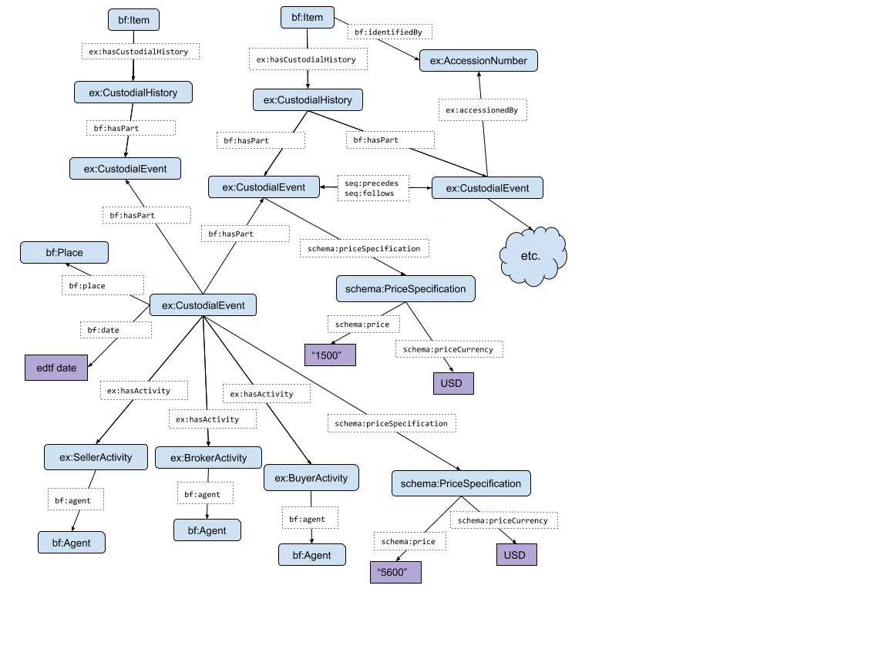

Custodial History : Provenance Ownership Model
=======

LD4P ArtFrame and RareMat Ontology Groups

_Created:_ 2017-10-04
_Revised:_ 2018-07-03

Table of Contents
------------------
- [Overview](#Overview)
- [Summary of the Model](#SummaryoftheModel)
- [Diagram](#Diagram)
- [RDF Sample](#RDFSample)
- [Requests to Library of Congress](#RequeststoLibraryofCongress)
- [Term Specifications](#TermSpecifications)
- [Areas for Future Research](#AreasforFutureResearch)

<a name="Overview">Overview</a>
------------------
Understanding the ownership or custodial history of an item is fundamental in understanding its contextual and historical importance as well as during valuation, when applicable. 

Current descriptive practice includes these data as strings. For instance:
"Unrecorded until purchased in 1893 from Agnew's by J. Pierpont Morgan; sold by him at auction in 1905; Christie's 1910; Pres. and Mrs. Nicholas Murray Butler; donated by their estate to Columbia in 1955."

In modeling ownership and custodial history, the ArtFrame and Rare Materials Ontology Extension groups wanted to leverage more queryable data afforded by an entity-focused model; this differs from both current descriptive practice as well as BIBFRAME use of bf:custodialHistory as a datatype property. As such, we recommend using object properties alongside resources for different components of custodial history.

An item's custodial history is complex and provides a rich area for querying. Through the model proposed below, we believe we can trace individual custodial histories for items in collections while aggregating materials related to the same auction, sale or donation.

While the custodial history model was developed specifically to address the descriptive needs of bibliographic items in the art and rare materials domains, we define it as an independent model with the expectation that it could be useful in the description of the custodial history of a broad range of resources.

<a name="SummaryoftheModel">Summary of the Model</a>
------------------

### Prefixes

The following prefixes are used in the remainder of this document:

activity: https://w3id.org/arm/activity/ontology/ - ARM Activity Ontology
arm: https://w3id.org/arm/core/ontology/ - ARM Core Ontology
bf: http://id.loc.gov/ontologies/bibframe/ - Library of Congress BIBFRAME ontology
ch: https://w3id.org/arm/custodial_history/ontology/ - ARM Custodial History Ontology (described in this document)
edtf: Extended Date/Time Format
schema: http://schema.org - Schema ontology
seq: http://www.ontologydesignpatterns.org/cp/owl/sequence.owl# Sequence ontology


### New resource types

The model posits two new classes for the description of a resource’s custodial history: CustodialEvent and CustodialHistory. 

A CustodialEvent represents a single event or period in the custodial history of a resource, such as a sale, donation, or period of ownership. The CustodialEvents for a specific Item are aggregated and potentially ordered in a CustodialHistory resource representing the entire custodial history of that Item. 

The CustodialEvent directly linked to the CustodialHistory of a resource (hereafter “individual CustodialEvent”) may be part of a larger CustodialEvent (hereafter “aggregate CustodialEvent”) encompassing multiple Items; e.g., a manuscript auctioned together with other manuscripts. Note that these are not distinct types of resources; rather, the distinction is maintained by direct or indirect linkage to a resource’s CustodialHistory. The individual CustodialEvent node intervening between a resource’s CustodialHistory and the aggregate CustodialEvent allows the individual events to be aggregated and sequenced independently of any other Item’s CustodialHistory. 

The CustodialHistory class is provided so that additional assertions can be made about it, distinct from assertions about specific events (the class also has conceptual appeal as a “container” of individual CustodialEvents). Whether this class is useful, as opposed to linking individual CustodialEvents directly to Items, remains to be seen through implementation and experimentation with the model (see Areas for Future Research).   

### Relationships between resources

-	Only the CustodialHistory resource is linked directly to the Item, via the predicate hasCustodialHistory. Each Item is linked to a maximum of one CustodialHistory.
-	The CustodialHistory of the Item is linked to one or more CustodialEvents via bf:hasPart (inverse bf:partOf).
-	An individual CustodialEvent may be linked to an aggregate CustodialEvent via bf:partOf (inverse bf:hasPart). 
-	Individual CustodialEvents may be sequenced in the CustodialHistory via seq:precedes, seq:follows, seq:directlyPrecedes, and seq:directlyFollows. 
> - Because seq:precedes and seq:follows do not imply immediate precedence or succession, new event assertions may be interjected between two existing events. When immediate precedence or succession is known, seq:directlyPrecedes and seq:directlyFollows can be used.
> -	The modeling of concurrent and overlapping events (e.g., when the loan of a manuscript to one institution overlaps two ownerships) is left for future research. 
> -	When two CustodialEvents belonging to two different Items are part of the same aggregrate CustodialEvent, they may well occupy different positions in the sequencing of each Item’s CustodialHistory. For example, a sale including two items may be the first event in one Item’s history and the second Event in the other Item’s history.
> -	While the model allows for sequencing of aggregate CustodialEvents, we expect this to have little utility in an implementation.
-	CustodialEvents may be linked to one or more activity:Activity objects, price subgraphs, dates (both intervals and discrete dates), locations, and so on. These relations may pertain to either individual or aggregate CustodialEvents; for example, an entire lot of manuscripts may have been purchased for $100K, but the price of a specific item in the lot was negotiated at $10K and its inclusion in the lot was brokered by an agent not related to the aggregate CustodialEvent.
-	An AccessionNumber may be linked as an Identifier to both a bf:Item (via bf:identifies/identifiedBy) and to a CustodialEvent (via ch:accessions/accessionedBy). See full [AccessionNumber recommendation](../accession_numbers.md).

### Types of custodial events and related activities

The types of CustodialEvents encompassed by the provenance model include the following (and possibly others yet to be identified):
- Sale
- Gift / Bequest
- Theft
- Transfer
- Offer
- Inheritance/Descent
- Loan
- Deposit 
- Destruction 
- Loss
- Recovery / Restitution 
- Repatriation 
- Discarded
- Deaccessioned 
- Accessioned 
- Claim of ownership

Each of these event types is represented by a subclass of CustodialEvent.

Note that these types of CustodialEvents include both what are typically thought of as “events” (sale, loan, etc.) and static time periods such as ownership. The former also subclass schema:Event. As a matter of implementation, a static period may pertain to only a single Item; e.g., Items sold together in one lot may later be sold in unrelated events, so that a single ownership event could not represent all Items. On the other hand, a single library can be sold multiple times together, and buyers may wish to keep the library intact as much as possible.

Both individual and aggregate CustodialEvents may be typed, but an individual event that is part of an aggregate event should have the same type, and typing is in that case redundant.

Activities appropriate to a specific CustodialEvent type are linked to a CustodialEvent instance. For example, a sale will typically have activities such as buyer and seller, while a loan may have activities such as borrower and lender. 

Importantly, this model enhances the Activity model by providing a way to connect interrelated or interdependent activities. For example, we can assert seller and buyer activities on an item, but have no way to express the fact that specific seller and buyer activities are related to one another. If multiple such activities are related to a single item, there is no way to express the relationship of particular activities to one another. Dates may sometimes serve that purpose but cannot be relied upon.

### Out-of-scope event and activity types

Concepts similar to but disjoint from ownership (i.e., to be represented by other models):
- Publication and production information (e.g., printer holds all items at time of printing)
- Exhibition history (handled in forthcoming Exhibits model)
- Creation activities (e.g., creator holds all items at time of creation)
- Commissions (involves works rather than items, not part of the custodial history of a resource)

<a name="Diagram">Diagram</a>
-----------



<a name="RDFSample">RDF Sample</a>
-----------
This sample describes a scenario in which one item has been sold twice, with an intervening period of ownership, and a second item has been sold once, as part of a lot that included the first sale of the first item.

```
:item1 a bf:Item ;
    ch:hasCustodialHistory :history1 .

:item2 a bf:Item ;
    ch:hasCustodialHistory :history2 .

:history1 a ch:CustodialHistory ;
    bf:hasPart :individualEvent1 ; :individualEvent2 ,  :individualEvent3 .

:history2 a ch:CustodialHistory ;
    bf:hasPart :individualEvent4 .

:individualEvent1 a ch:SaleEvent ; 
    seq:precedes :individualEvent2 ;
    bf:partOf :aggregateEvent1 .

:individualEvent2 a ch:OwnershipEvent ; 
    seq:precedes :individualEvent3 .
    
:individualEvent3 a ch:SaleEvent .

:individualEvent4 a ch:CustodialEvent ;
    bf:partOf :aggregateEvent1 .

:aggregateEvent1 a ch:SaleEvent ;
    activity:hasActivity :sellerActivity1 ;
    bf:date “1984”^^edtf:edtf ;
    arm:atLocation <uri-of-location> ;
    schema:priceSpecification :price1 .

:sellerActivity1 a ch:SellerActivity ;
    bf:agent <uri-of-agent> .

:price1 a schema:PriceSpecification ;
    schema:price “10” ;
    # Note: The Schema definition of priceCurrency specifies the object as
    # a 3-letter ISO 4217 format - i.e., a literal rather than a URI. This
    # is left as [an area for future research](#AreasForFutureResearch).
    schema:priceCurrency <iso-4217-code> .  
```

<a name="RequeststoLibraryofCongress">Requests to Library of Congress</a>
-----------
**bf:custodialHistory**

- Change bf:custodialHistory into an object property, as in [Term Specifications](#TermSpecifications) below.
  - If LC does not approve this request, ArtFrame/RareMat will define these terms in a namespace TBD for its Exhibition ontology.

**Define custodial history-related classes**

- Define the following classes as in [Term Specifications](#TermSpecifications) below.
- bf:CustodialHistory
- bf:CustodialEvent
  - If LC does not approve this request, ArtFrame/RareMat will define these terms in a namespace TBD for its Exhibition ontology.

**bf:Event**

- The definition of bf:Event is “Something that happens at a certain time and location, such as a performance, speech, or athletic  
  event, that is documented by a resource.” We request removal of the phrase “that is documented by a resource,” allowing events to be 
  modeled in contexts other than as the event content of a work. 
  - If this recommendation is accepted, we will use bf:Event and define a subclass arm:ExhibitionEvent. Otherwise, we will use  
    schema:Event and its subclass schema:ExhibitionEvent. 
  - In either case, we will define the [Event types detailed below](#TermSpecifications).
- Our ultimate recommendation would be to remove bf:Event and implement or use an Event ontology (so far we have not identified   
  a suitable existing one), but this is a complex project and likely far in the future.


<a name="TermSpecifications">Term Specifications</a>
-------

### Classes

**schema:Event**
> - **Label**: Event
> - **URI**: http://schema.org/Event
> - **Definition**: An event happening at a certain time and location, such as a concert, lecture, or festival. Ticketing information may be added via the offers property. Repeated events may be structured as separate Event objects. 

**bf:Item**
> - **Label**: Item
> - **URI**: http://id.loc.gov/ontologies/bibframe/Item
> - **Definition**: Single example of an Instance. 

**ch:CustodialHistory**
> - **Label**: Custodial history
> - **URI**: https://w3id.org/arm/custodial_history/ontology/CustodialHistory
> - **Definition**: Entity that aggregates all of the custodial events for a resource.
> - **Comment**: An Item has a single ch:CustodialHistory, which is composed of one or more ch:CustodialEvent resources. The Item is directly linked only to its CustodialHistory.


**ch:CustodialEvent**
> - **Label**: Custodial event
> - **URI**: https://w3id.org/arm/custodial_history/ontology/CustodialEvent
> - **Definition**: A custodial event encompassing one or more Items, such as a sale or loan.
> - **Comment**: A CustodialEvent may pertain to only a single Item, in which case it is linked directly to the Item’s CustodialHistory, or it may encompass multiple Items (such as an auction lot), in which case the CustodialEvent aggregates multiple individual CustodialEvents. A CustodialEvent may be what is typically conceived of as an “event,” or a “static” event such as Ownership. Subclasses are accordingly either defined as subclasses of schema:Event or not.


### CustodialEvent Subclasses

Some of these classes are also defined as subclasses of schema:Event. “Static” events such as Ownership do not subclass schema:Event.

**ch:Accessioning**
> - **Label**: Accessioning
> - **URI**: https://w3id.org/arm/custodial_history/ontology/Accessioning
> - **Definition**: The act of adding an item to the accessions records of a cultural heritage institution.
> - **Comment**: Typical associated Activities: AccessionerActivity.
> - **SubclassOf**: ch:CustodialEvent, schema:Event.

**ch:Auction**
> - **Label**: Auction
> - **URI**: https://w3id.org/arm/custodial_history/ontology/Auction
> - **Definition**: The sale at auction of a resource. 
> - **Comment**: Refers to the transfer of ownership through auction, rather than the auction in which that occurs. Typical associated Activities: BuyerActivity, SellerActivity, DealerActivity.
> - **SubclassOf**: ch:Sale, schema:Event.

**ch:Bequest**
> - **Label**: Bequest
> - **URI**: https://w3id.org/arm/custodial_history/ontology/Bequest
> - **Definition**: The transfer of a resource under the terms of a will.
> - **Comment**: Typical associated Activities: TestatorActivity, InheritorActivity, WitnessActivity.
> - **SubclassOf**: ch:Inheritance, schema:Event

**ch:ClaimOfOwnership**
> - **Label**: Claim of ownership
> - **URI**: https://w3id.org/arm/custodial_history/ontology/ClaimOfOwnership
> - **Definition**: A legal claim to the right of possession of a resource.
> - **Comment**: Typical associated Activities: ClaimantActivity, DisputantActivity.
> - **SubclassOf**: ch:CustodialEvent.

**ch:Deaccessioning**
> - **Label**: Deaccessioning
> - **URI**: https://w3id.org/arm/custodial_history/ontology/Deaccessioning
> - **Definition**: The removal of an item from the accessions records of a cultural heritage institution. 
> - **Comment**: Typical associated Activities: DeaccessionerActivity.
> - **SubclassOf**: ch:CustodialEvent, schema:Event.

**ch:Deposit**
> - **Label**: Deposit
> - **URI**: https://w3id.org/arm/custodial_history/ontology/Deposit
> - **Definition**: The placement of an item in the collections of a cultural heritage institution.
> - **Comment**: Typical associated Activities: DepositorActivity.
> - **SubclassOf**: ch:CustodialEvent, schema:Event.

**ch:Destruction**
> - **Label**: Destruction
> - **URI**: https://w3id.org/arm/custodial_history/ontology/Destruction
> - **Definition**: The permanent ruination of a resource.
> - **Comment**: Typical associated Activities: DestructionActivity, OwnerActivity.
> - **SubclassOf**: ch:CustodialEvent, schema:Event.

**ch:Discarding**
> - **Label**: Discarding
> - **URI**: https://w3id.org/arm/custodial_history/ontology/Discarding
> - **Definition**: The abandonment or disposal of a resource.
> - **Comment**: Typical associated Activities: DiscarderActivity, OwnerActivity.
> - **SubclassOf**: ch:CustodialEvent, schema:Event.

**ch:Donation**
> - **Label**: Donation
> - **URI**: https://w3id.org/arm/custodial_history/ontology/Donation
> - **Definition**: The giving of a resource, typically for charitable purposes and/or to benefit a cause.
> - **Comment**: Typical associated Activities: DonorActivity, RecipientActivity.
> - **SubclassOf**: ch:CustodialEvent, schema:Event.

**ch:Inheritance**
> - **Label**: Inheritance
> - **URI**: https://w3id.org/arm/custodial_history/ontology/Inheritance
> - **Definition**: The transfer of a resource following the death of the previous owner, either by bequest or by the application of law.
> - **Comment**: Typical associated Activities: TestatorActivity, InheritorActivity.
> - **SubclassOf**: ch:CustodialEvent, schema:Event.
> - **SuperclassOf**: ch:Bequest

**ch:Loan**
> - **Label**: Loan
> - **URI**: https://w3id.org/arm/custodial_history/ontology/Loan
> - **Definition**: The temporary transfer of a resource.
> - **Comment**: Typical associated Activities: LenderActivity, BorrowerActivity.
> - **SubclassOf**: ch:CustodialEvent, schema:Event.

**ch:Loss**
> - **Label**: Loss
> - **URI**: https://w3id.org/arm/custodial_history/ontology/Loss
> - **Definition**: The disappearance  of a resource under unknown circumstances (e.g., not in the case of theft).
> - **Comment**: Typical associated Activities: LossActivity, OwnerActivity.
> - **SubclassOf**: ch:CustodialEvent, schema:Event.

**ch:Offer**
> - **Label**: Offer
> - **URI**: https://w3id.org/arm/custodial_history/ontology/Offer
> - **Definition**: The provision of a resource for purchase or other form of acquisition.
> - **Comment**: Typical associated Activities: OfferActivity, RecipientActivity.
> - **SubclassOf**: ch:CustodialEvent, schema:Event.

**ch:Ownership**
> - **Label**: Ownership
> - **URI**: https://w3id.org/arm/custodial_history/ontology/Ownership
> - **Definition**: The possession of full and complete right of control over a resource.
> - **Comment**: Typical associated Activities: OwnerActivity.
> - **SubclassOf**: ch:CustodialEvent.

**ch:Recovery**
> - **Label**: Recovery
> - **URI**: https://w3id.org/arm/custodial_history/ontology/Recovery
> - **Definition**: The restitution or regaining possession of a resource.
> - **Comment**: Typical associated Activities: RecovererActivity.
> - **SubclassOf**: ch:CustodialEvent, schema:Event.

**ch:Repatriation**
> - **Label**: Repatriation
> - **URI**: https://w3id.org/arm/custodial_history/ontology/Repatriation
> - **Definition**: The return of a resource to its country of origin.
> - **Comment**: Typical associated Activities: RepatriatorActivity
> - **SubclassOf**: ch:CustodialEvent, schema:Event.

**ch:Sale**
> - **Label**: Sale
> - **URI**: https://w3id.org/arm/custodial_history/ontology/Sale
> - **Definition**: The exchange of a resource for money or other object of value.
> - **Comment**: Typical associated Activities: BuyerActivity, SellerActivity, DealerActivity.
> - **SubclassOf**: ch:CustodialEvent, bf:SaleEvent.

**ch:Theft**
> - **Label**: Theft
> - **URI**: https://w3id.org/arm/custodial_history/ontology/Theft
> - **Definition**: The removal of a resource from the possession of the rightful owner without the latter’s consent.
> - **Comment**: Typical associated Activities: ThiefActivity, OwnerActivity.
> - **SubclassOf**: ch:CustodialEvent, schema:Event.

**ch:Transfer**
> - **Label**: Transfer
> - **URI**: https://w3id.org/arm/custodial_history/ontology/Transfer
> - **Definition**: The passing of ownership or other right from one party to another.
> - **Comment**: Typical associated Activities: TranfererActivity, RecipientActivity.
> - **SubclassOf**: ch:CustodialEvent, schema:Event.

--------
**ch:Activity**
> - **Label**: Activity
> - **URI**: https://w3id.org/arm/custodial_history/ontology/Activity
> - **Definition**: An activity or contribution by a single agent that affects or alters the existence or state of a resource.

Activity Subclasses
---------- 

**ch:AccessionerActivity**
> - **Label**: Accessioner
> - **URI**: https://w3id.org/arm/custodial_history/ontology/AccessionerActivity
> - **SubclassOf**: https://w3id.org/arm/custodial_history/ontology/Activity
> - **Definition**: The act of adding a resource to a collection.

**ch:AcquisitionActivity**
> - **Label**: Acquisition
> - **URI**: https://w3id.org/arm/custodial_history/ontology/AcquisitionActivity
> - **SubclassOf**: https://w3id.org/arm/custodial_history/ontology/Activity
> - **Definition**: The act of gaining possession of a resource.

**ch:BorrowerActivity**
> - **Label**: Borrower
> - **URI**: https://w3id.org/arm/custodial_history/ontology/BorrowerActivity
> - **SubclassOf**: https://w3id.org/arm/custodial_history/ontology/Activity
> - **Definition**: The act of taking possession, but not ownership, of a resource.

**ch:BuyerActivity**
> - **Label**: Broker
> - **URI**: https://w3id.org/arm/custodial_history/ontology/BuyerActivity
> - **SubclassOf**: https://w3id.org/arm/custodial_history/ontology/Activity
> - **Definition**: The act of purchasing a resource.

**ch:ClaimantActivity**
> - **Label**: Claimant
> - **URI**: https://w3id.org/arm/custodial_history/ontology/ClaimantActivity
> - **SubclassOf**: https://w3id.org/arm/custodial_history/ontology/Activity
> - **Definition**: The act of declaring ownership of a resource, notably when the claim is not clearly substantiated.

**ch:DeaccessionerActivity**
> - **Label**: Deaccessioner
> - **URI**: https://w3id.org/arm/custodial_history/ontology/DeaccessionerActivity
> - **SubclassOf**: https://w3id.org/arm/custodial_history/ontology/Activity
> - **Definition**: The act of permanently removing accessioned items from a collection or repository.

**ch:DealerActivity**
> - **Label**: Dealer
> - **URI**: https://w3id.org/arm/custodial_history/ontology/DealerActivity
> - **SubclassOf**: https://w3id.org/arm/custodial_history/ontology/Activity
> - **Definition**: The act of negotiating or arranging for a transaction.

**ch:DepositorActivity**
> - **Label**: Depositor
> - **URI**: https://w3id.org/arm/custodial_history/ontology/DepositorActivity
> - **SubclassOf**: https://w3id.org/arm/custodial_history/ontology/Activity
> - **Definition**: The act of placing a resource into the custody of another person, family, or organization.

**ch:DestructionActivity**
> - **Label**: Destroyer
> - **URI**: https://w3id.org/arm/custodial_history/ontology/DestructionActivity
> - **SubclassOf**: https://w3id.org/arm/custodial_history/ontology/Activity
> - **Definition**: The act of permanently destroying a resource.

**ch:DiscarderActivity**
> - **Label**: Discarder
> - **URI**: https://w3id.org/arm/custodial_history/ontology/DiscarderActivity
> - **SubclassOf**: https://w3id.org/arm/custodial_history/ontology/Activity
> - **Definition**: The act of permanently removing a resource or part of a resource from a collection for disposal.

**ch:DisputantActivity**
> - **Label**: Disputant
> - **URI**: https://w3id.org/arm/custodial_history/ontology/DisputantActivity
> - **SubclassOf**: https://w3id.org/arm/custodial_history/ontology/Activity
> - **Definition**: The act of challenging a claim, such as a claim of ownership.

**ch:DonorActivity**
> - **Label**: Donor
> - **URI**: https://w3id.org/arm/custodial_history/ontology/DonorActivity
> - **SubclassOf**: https://w3id.org/arm/custodial_history/ontology/Activity
> - **Definition**: The act of giving a resource to another owner without monetary exchange.

**ch:InheritorActivity**
> - **Label**: Inheritor
> - **URI**: https://w3id.org/arm/custodial_history/ontology/InheritorActivity
> - **SubclassOf**: https://w3id.org/arm/custodial_history/ontology/Activity
> - **Definition**: The act of taking possession of a resource upon the death of the previous owner, either through bequest or application of law.

**ch:LenderActivity**
> - **Label**: Lender
> - **URI**: https://w3id.org/arm/custodial_history/ontology/LenderActivity
> - **SubclassOf**: https://w3id.org/arm/custodial_history/ontology/Activity
> - **Definition**: The act of permitting the temporary possession of one more more Items.

**ch:LossActivity**
> - **Label**: Loss
> - **URI**: https://w3id.org/arm/custodial_history/ontology/LossActivity
> - **SubclassOf**: https://w3id.org/arm/custodial_history/ontology/Activity
> - **Definition**: Responsibility for the disappearance of a resource where the circumstances of the disappearance are unknown.

**ch:OfferActivity**
> - **Label**: Offerer
> - **URI**: https://w3id.org/arm/custodial_history/ontology/OfferActivity
> - **SubclassOf**: https://w3id.org/arm/custodial_history/ontology/Activity
> - **Definition**: The act of providing a resource for purchase or other form of acquisition. Use for booksellers and sellers of other resources.

**ch:OwnerActivity**
> - **Label**: Owner
> - **URI**: https://w3id.org/arm/custodial_history/ontology/OwnerActivity
> - **SubclassOf**: https://w3id.org/arm/custodial_history/ontology/Activity
> - **Definition**: The legal possession of a resource.

**ch:PatronActivity**
> - **Label**: Patron
> - **URI**: https://w3id.org/arm/custodial_history/ontology/PatronActivity
> - **SubclassOf**: https://w3id.org/arm/custodial_history/ontology/PatronActivity
> - **Definition**: The activity of commissioning a work. Usually a patron uses his or her means or influence to support the work of artists, writers, etc. This includes those who commission and pay for individual works.

**ch:RecipientActivity**
> - **Label**: Recipient
> - **URI**: https://w3id.org/arm/custodial_history/ontology/RecipientActivity
> - **SubclassOf**: https://w3id.org/arm/custodial_history/ontology/Activity
> - **Definition**: The act of receiving a resource, via bequest, donation, etc.

**ch:RecovererActivity**
> - **Label**: Recoverer
> - **URI**: https://w3id.org/arm/custodial_history/ontology/RecovererActivity
> - **SubclassOf**: https://w3id.org/arm/custodial_history/ontology/Activity
> - **Definition**: The act of re-assuming ownership of a resource following a period of loss, possibly due to theft.

**ch:RepatriatorActivity**
> - **Label**: Repatriator
> - **URI**: https://w3id.org/arm/custodial_history/ontology/RepatriatorActivity
> - **SubclassOf**: https://w3id.org/arm/custodial_history/ontology/Activity
> - **Definition**: The act of returning a resource to its home country.

**ch:SellerActivity**
> - **Label**: Seller
> - **URI**: https://w3id.org/arm/custodial_history/ontology/SellerActivity
> - **SubclassOf**: https://w3id.org/arm/custodial_history/ontology/Activity
> - **Definition**: The act of exchanging ownership of a resource for money or other object of value. 

**ch:TestatorActivity**
> - **Label**: Testator
> - **URI**: https://w3id.org/arm/custodial_history/ontology/TestatorActivity
> - **SubclassOf**: https://w3id.org/arm/custodial_history/ontology/Activity
> - **Definition**: The act of bequeathing a resource in a will.

**ch:ThiefActivity**
> - **Label**: Thief
> - **URI**: https://w3id.org/arm/custodial_history/ontology/ThiefActivity
> - **SubclassOf**: https://w3id.org/arm/custodial_history/ontology/Activity
> - **Definition**: The act of acquiring a resource without the consent of the legal owner.

**ch:TransfererActivity**
> - **Label**: Transferer
> - **URI**: https://w3id.org/arm/custodial_history/ontology/TransfererActivity
> - **SubclassOf**: https://w3id.org/arm/custodial_history/ontology/Activity
> - **Definition**: The act of giving possession of a resource to another party, notably without a defined sale or donation.

**ch:WitnessActivity**
> - **Label**: Witness
> - **URI**: https://w3id.org/arm/custodial_history/ontology/WitnessActivity
> - **SubclassOf**: https://w3id.org/arm/custodial_history/ontology/Activity
> - **Definition**: The activity of verifying the truthfulness of an event or action.

**arm:AccessionNumber**
> - **Label**: Accession Number
> - **URI**: https://w3id.org/arm/custodial_history/ontology/AccessionNumber
> - **Definition**: Numeric, alphanumeric, or other identifying code assigned when an art object, book, or other item enters the collection of a museum, library, or other repository. Such codes are unique within the set of codes, and specifically identify the particular item at hand. The numbers may be marked on the objects or not (http://vocab.getty.edu/aat/300312355)
> - **SubclassOf**: http://id.loc.gov/ontologies/bibframe/Identifier  

**bf:Agent**
> - **Label**: Agent
> - **URI**: http://id.loc.gov/ontologies/bibframe/Agent
> - **Definition**: Entity having a role in a resource, such as a person or organization.

**bf:Place**
> - **Label**: Place
> - **URI**: http://id.loc.gov/ontologies/bibframe/Place
> - **Definition**: Geographic location.

**schema:PriceSpecification**
> - **Label**: Price Specification
> - **URI**: https://schema.org/PriceSpecification
> - **Comment**: One or more detailed price specifications, indicating the unit price and delivery or payment charges.


### Properties

**ch:accessions**
> - **Label**: accessions
> - **URI**: https://w3id.org/arm/custodial_history/ontology/accessions
> - **Domain**: arm:AccessionNumber
> - **Range**: ch:CustodialEvent
> - **Definition**: 
> - **Inverse**: ch:accessionedBy

**ch:accessionedBy**
> - **Label**: accessionedBy
> - **URI**: https://w3id.org/arm/custodial_history/ontology/accessionedBy
> - **Domain**: CustodialEvent
> - **Range**: arm:AccessionNumber
> - **Definition**: 
> - **Inverse**: ch:accessions

**activity:hasActivity**
> - **Label**: has activity
> - **URI**: https://w3id.org/arm/custodial_history/ontology/hasActivity
> - **Domain**: unspecified
> - **Range**: https://w3id.org/arm/custodial_history/ontology/Activity
> - **Inverse**: https://w3id.org/arm/custodial_history/ontology/isActivityOf
> - **Definition**: Relates this resource to an activity or contribution by a single agent that affects or alters its existence or state.

**activity:isActivityOf**
> - **Label**: is activity of
> - **URI**: https://w3id.org/arm/custodial_history/ontology/isActivityOf
> - **Domain**: https://w3id.org/arm/custodial_history/ontology/Activity
> - **Range**: unspecified
> - **Inverse**: https://w3id.org/arm/custodial_history/ontology/hasActivity
> - **Definition**: Relates an activity to the affected resource.

**ch:hasCustodialHistory** 
> - **Label**: has custodial history
> - **URI**: https://w3id.org/arm/custodial_history/ontology/hasCustodialHistory
> - **Domain**: unspecified
> - **Range**: ch:CustodialHistory
> - **Inverse**: ch:isCustodialHistoryOf
> - **Definition**: Relates a resource to its custodial history.
> - **Comment**: 

**ch:isCustodialHistoryOf** 
> - **Label**: is custodial history of
> - **URI**: https://w3id.org/arm/custodial_history/ontology/isCustodialHistoryOf
> - **Domain**: ch:CustodialHistory
> - **Range**: unspecified
> - **Inverse**: ch:hasCustodialHistory
> - **Definition**: Relates a CustodialHistory resource to the resource it belongs to.

**bf:hasPart** 
> - **Label**: Has Part
> - **URI**: http://id.loc.gov/ontologies/bibframe/hasPart
> - **Domain**: unspecified
> - **Range**: unspecified
> - **Comment**: Resource that is included either physically or logically in the described resource

**bf:partOf** 
> - **Label**: Is part of
> - **URI**: http://id.loc.gov/ontologies/bibframe/partOf
> - **Domain**: unspecified
> - **Range**: unspecified
> - **Comment**: Resource in which the described resource is physically or logically contained.

**seq:precedes**
> - **Label**: precedes
> - **URI**: http://www.ontologydesignpatterns.org/cp/owl/sequence.owl#precedes
> - **Domain**: owl:Thing
> - **Range**: owl:Thing
> - **Comment**: A relation between entities, expressing a 'sequence' schema. E.g. 'year 1999 precedes 2000', 'deciding what coffee to use' precedes 'preparing coffee', 'World War II follows World War I', 'in the Milan to Rome autoroute, Bologna precedes Florence', etc. It can then be used between tasks, processes, time intervals, spatially locate objects, situations, etc. Subproperties can be defined in order to distinguish the different uses.

**seq:follows**
> - **Label**: follows
> - **URI**: http://www.ontologydesignpatterns.org/cp/owl/sequence.owl#follows
> - **Domain**: owl:Thing
> - **Range**: owl:Thing
> - **Comment**: A relation between entities, expressing a 'sequence' schema. E.g. 'year 2000 follows 1999', 'preparing coffee' follows 'deciding what coffee to use', 'II World War follows I World War', etc. It can be used between tasks, processes or time intervals, and subproperties would fit best in order to distinguish the different uses.

**seq:directlyPrecedes**
> - **Label**: directly precedes
> - **URI**: http://www.ontologydesignpatterns.org/cp/owl/sequence.owl#directlyPrecedes
> - **Domain**: owl:Thing
> - **Range**: owl:Thing
> - **Comment**: The intransitive precedes relation. For example, Monday directly precedes Tuesday. Directness of precedence depends on the designer conceptualization.

**seq:directlyFollows**
> - **Label**: directly follows
> - **URI**: http://www.ontologydesignpatterns.org/cp/owl/sequence.owl#directlyFollows
> - **Domain**: owl:Thing
> - **Range**: owl:Thing
> - **Comment**: The intransitive follows relation. For example, Wednesday directly precedes Thursday. Directness of precedence depends on the designer conceptualization.

**bf:place** 
> - **Label**: Place
> - **URI**: http://id.loc.gov/ontologies/bibframe/place
> - **Domain**: unspecified
> - **Range**: http://id.loc.gov/ontologies/bibframe/Place
> - **Inverse**: unspecified
> - **Definition**: Geographic location or place entity associated with a resource or element of description, such as the place associated with the publication, printing, distribution, issue, release or production of a resource, place of an event.

**arm:isLocationOf** 
> - **Label**: is location of
> - **URI**: https://w3id.org/arm/custodial_history/ontology/isLocationOf
> - **Domain**: http://id.loc.gov/ontologies/bibframe/Place
> - **Range**: unspecified
> - **Inverse**: http://id.loc.gov/ontologies/bibframe/place
> - **Definition**: The resource being described is at the specified location.

**bf:date** 
> - **Label**: Date
> - **URI**: http://id.loc.gov/ontologies/bibframe/date
> - **Domain**: unspecified 
> - **Range**: unspecified
> - **Definition**: Date designation associated with a resource or element of description, such as date of title variation; year a degree was awarded; date associated with the publication, printing, distribution, issue, release or production of a resource. May be date typed.
> - **Comment**: Date may be used to express temporal information at any level of granularity.

**schema:price**
> - **Label**: price
> - **URI**: http://schema.org/price
> - **Domain**: unspecified
> - **Used with**: schema:PriceSpecification
> - **Range**: unspecified
> - **Expected value**: Literal
> - **Definition**: The offer price of a product, or of a price component when attached to PriceSpecification and its subtypes.

**schema:priceCurrency**
> - **Label**: Price Currency
> - **URI**: https://schema.org/priceCurrency
> - **Domain**: unspecified
> - **Used with**: schema:PriceSpecification
> - **Range**: unspecified 
> - **Expected value**: Literal
> - **Definition**: The currency (in 3-letter ISO 4217 format) of the price or a price component, when attached to PriceSpecification and its subtypes.

**schema:priceSpecification**
> - **Label**: Price Specification
> - **URI**: https://schema.org/priceSpecification
> - **Domain**: unspecified
> - **Range**: unspecified 
> - **Expected value**: schema:PriceSpecification
> - **Definition**: One or more detailed price specifications, indicating the unit price and delivery or payment charges.

**bf:agent** 
> - **Label**: Associated agent
> - **URI**: http://id.loc.gov/ontologies/bibframe/agent
> - **Domain**: unspecified 
> - **Range**: bf:Agent
> - **Inverse**: 
> - **Definition**: Relates an activity to its agent.

**arm:agentOf** 
> - **Label**: agent of
> - **URI**: https://w3id.org/arm/core/ontology/agentOf
> - **Domain**: bf:Agent
> - **Range**: unspecified 
> - **Inverse**: http://id.loc.gov/ontologies/bibframe/agent
> - **Definition**: Relates an agent to the activity it participated in.

<a name="AreasforFutureResearch">Areas for Future Research</a>
----------
- Public versus private data in this model is left as an implementation issue. Given that this model contains potentially sensitive data (e.g.: donors, value, etc.), implementers must consider how sensitive data are handled in their application. Note that the public/private issue is not specific to provenance data and extends into other library and non-library data as well.
- Modeling of confidence level. This also applies beyond the provenance domain.
- Consider defining two subclasses of CustodialEvent, one for individual (single Item) and one for aggregate (multi-Item) events. 
    - Originally the custodial history model distinguished aggregate from individual custodial events formally, using two different classes. We then decided that the types of resources would be profiled similarly, with properties and relationships such as activities, dates, locations, price, etc, and we collapsed them into a single class.
    - In working on the application profiles for [VitroLib](https://github.com/ld4l-labs/vitrolib), it now appears to me that the distinction both (a) is important, perhaps *_defining_*, and (b) facilitates application functionality. In general it is not good practice to bend the ontology to suit the application, but in this case the difficulty posed for applications may well suggest a deficiency in the model.
    - The primary difference between the two is that the individual event attaches directly to a custodial history resource, whereas the aggregate event does not, and attaches only to individual custodial events. This is a fundamental distinction in the semantics and the behavior. The difficulty in the application is that when the user wants to add a bf:partOf relationship between an individual and an aggregate event, he/she should be presented with choices of only the aggregate type - which has no definition in the model other than it is *_not_* attached directly to a CustodialHistory resource, and is attached directly to a custodial event that *_is_* attached to an item.
    - The proposal would be to define a CustodialEvent class, with two subclasses, IndividualCustodialEvent and AggregateCustodialEvent. This both provides for the common profiling of the two types of custodial events and also models the important distinctions between them.
    - Note also that the aggregate CustodialEvent cannot have an accession number.
- Currently the only hierarchical relationship among CustodialEvent subclasses is that Auction is defined as a subclass of Sale. Consider implementing a deeper class hierarchy in terms of the CustodialEvent subclasses. E.g., Transfer could be a superclass of Bequest, Donation, Sale, etc. Similar remarks apply to the Activity class hierarchy (e.g., ComposerActivity and AuthorActivity should be subclasses of CreatorActivity; all should be subclasses of ContributorActivity), if the Activity model is retained rather than being replaced by the BIBFRAME Contribution model.
- Concurrent and overlapping events. The lending use case, for example, will raise issues of sequencing, overlapping, and concurrency. We should not rely on dates to provide this type of nuanced sequencing since dates (even approximate dates) may not be known.
- Consider use of a predicate such as frapo:hasOutput (also used in the PhysicalCondition model) to express a causal relationship to another event or state (e.g., a sale results in an ownership). This cannot always be determined from sequencing, since there can be gaps in the sequence. 
- How strong is the case for the CustodialHistory class? It is essentially a container for the various CustodialEvent pertaining to a resource. However, there may be assertions on the history as a whole that do not apply to a specific event, such as an annotation. We expect this question to be addressed by implementation of and experimentation with the model, and leave open the possibility of future deprecation.
    - In the particular case of [VitroLib](https://github.com/ld4l-labs/vitrolib) implementation, it was noted that the CustodialHistory node caused some implementation difficulties which also highlighted a probably lack of utility. Since there is a 1-1, immutable relationship between Item and CustodialHistory, there is no point to it _unless_ other attributes may be assigned. (This is not to suggest that the
    model should be constructed to fit particular applications, but is perhaps suggestive of a redundancy in the model.)
- Would there be value in defining a superclass of “static” events such as ownership, parallel to the use of schema:Event? - Would it be a subclass of CustodialEvent, or orthogonal to it, like schema:Event? Are there existing terms for this concept?
- Consider augmenting the Activity class hierarchy by capturing general concepts of “giver” and “recipient” (for the latter, the RecipientActivity is already defined), and defining more specific activities such as SellerActivity, LenderActivity, TestatorActivity, etc. as “givers” and BuyerActivity, BorrowerActivity, InheritorActivity, etc. as subclasses of RecipientActivity.
- The modeling of unary events (with only one associated Activity, such as AccessionerActivity) involves some redundancy. Should the model be made more concise by eliminating the event and allowing an activity to link directly to the CustodialHistory? (Note that this would require keeping the CustodialHistory class in order to fully reconstruct a resource’s custodial history; see above on the value of the CustodialHistory class.) On the other hand, maintaining the Event-Activity distinction allows for other activities related to such an event, not currently apparent, to easily be added.
- Extend the Event-to-Activity model to other modeling areas, and bibliotek-o as a whole, where relevant. Consider renaming Activity to “Role” to clearly differentiate it from an event. The Activity is really the reification of an agent’s role in a resource, whether that be a bibliographic resource or an event, etc.
- Consider expanding CustodialHistory to include non-provenance-related events, such as rebinding. Considerations:
  - May want to replace CustodialHistory with the broader term History, though "custody" defined as “the protective care or guardianship of someone or something" may be broad enough to encompass conservation activities as well. There might be other events in the history of a resource that do not fit under the definition of "custody," however.  
  - What are the pros and cons of including non-custodial and custodial events in the same timeline? 
  - Could provide another argument for allowing Activities to attach directly to the History, rather than requiring an intervening custodial or other event; otherwise, one would need to define events for all the activities in the physical condition model (and perhaps other models): condition assessment activity, conservator activity, etc. Or, as above, do away with the history aggregator node altogether and attach individual events and activities directly to the item. The history would then be reconstructed from the various events and activities rather than provided as a unit in a container node.
  - Would require confronting the issue of overlapping and concurrent events, since conservation activities provide a strong use case (e.g., rebinding during a period of ownership).
- schema:priceSpecification takes a literal value in 3-letter ISO 4217 format as its object; whereas we would like to use URIs if possible. Determine whether an RDF vocabulary for currencies exists, and consider whether it is appropriate to use as object of schema:priceSpecification.